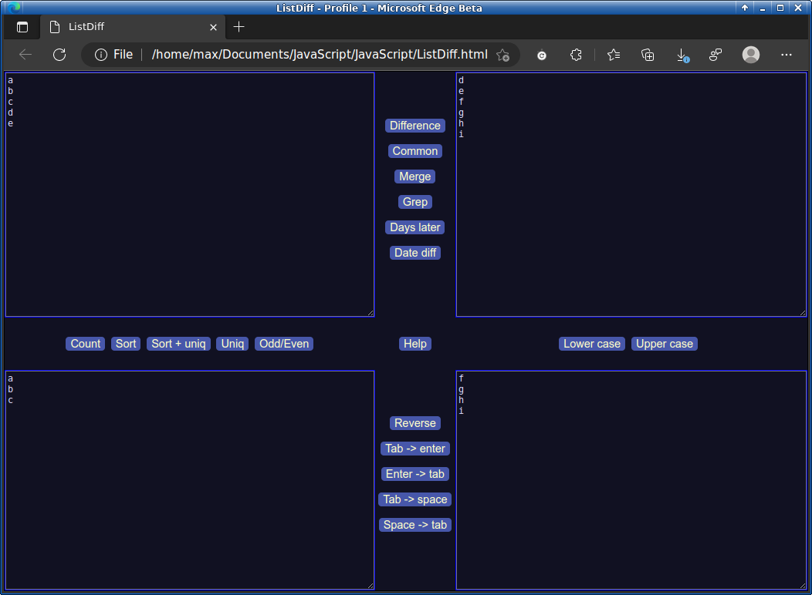

# ListDiff
A powerful text-processing / diff'ing multitool built in vamilla JavaScript

Input fields are on the top and right, output fields are typically below and to the left of the input fields.  In other words, it flows from right-to-left and top-to-bottom, and sometimes -- both.

In the example shown, the top left and right fields are diff'ed.  The elements on top-left-list which are not in top-right-list are shown on the bottom-left-list and vice-versa.

This supports many operations such as top-left can be sorted and uniq'ed -- it's output then sent below.  Once sent below the sorted list in the bottom left can be sent to the bottom right having been switched from a vertical list to a single tab-delimited line of items.  There are many more functions that are added.

This project really truly is a nod to the power of JavaScript alone without any frameworks or libraries.  Particularly the advanced array functions and string processing capabilities.

